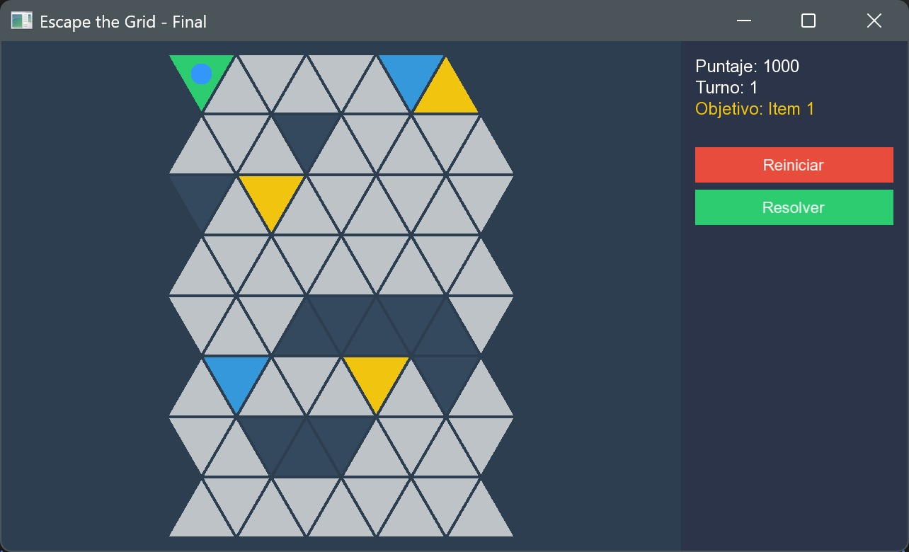

# **Escape the Grid: Caja Mágica**

## **Descripción General del Juego**

Escape the Grid es un juego de puzzle 2D desarrollado en C++ con SFML, donde el jugador debe navegar una compleja malla de triángulos para encontrar una salida oculta el cual no será nada fácil de encontrar.

!!!note
    El juego implementa la variante "**Caja Mágica**" con cada una de sus mecánicas desafiantes.

## **Objetivo del Juego**

El jugador se encuentra atrapado en un laberinto dinámico. La salida no es visible al principio; para revelarla, el jugador debe activar la "Caja Mágica" encontrando y recolectando una secuencia de tres ítems en el orden correcto (1 → 2 → 3). Solo entonces la salida se materializará, permitiendo el escape.

El proyecto cuenta con un modo de juego manual y un solver de IA basado en el algoritmo A* que puede encontrar y ejecutar la solución óptima desde cualquier punto de la partida.

