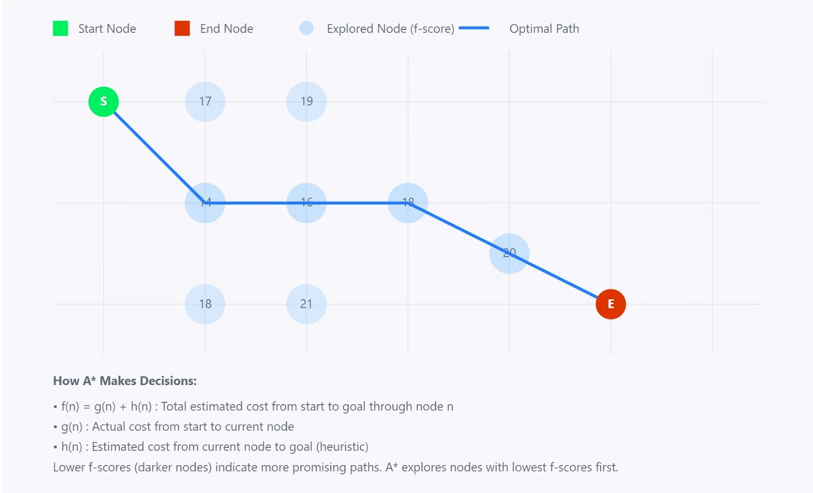
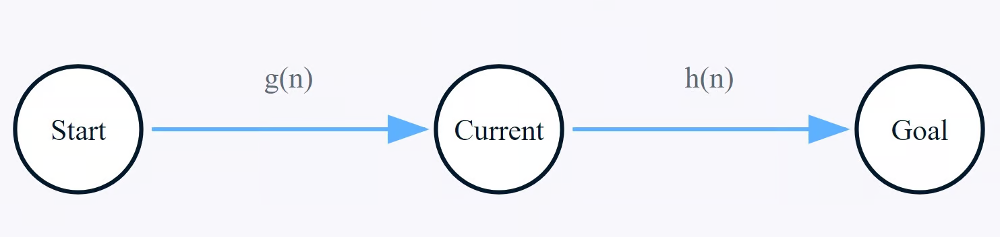

# **Algoritmo A* y su Implementación**

La base algorítmica del proyecto "Escape the Grid" se fundamenta en dos componentes principales: la representación del mapa del juego como un grafo y un sistema de búsqueda de caminos inteligente. Este sistema es capaz de adaptarse a las reglas dinámicas del puzzle en la variante “Caja Mágica” para su resolución automática.

Para ello, se ha diseñado un algoritmo capaz de resolver un puzzle complejo con las siguientes características:

- Un entorno no estándar basado en una **malla de triángulos**.
- **Múltiples objetivos secuenciales** que deben ser alcanzados en un orden predefinido (la mecánica de la "Caja Mágica").
- **Restricciones dinámicas**, donde el estado del mapa cambia con el tiempo (hay celdas que inician accesibles, pero al haber pasado $N$ turnos, se convierten en paredes).

Para resolver esta problemática, se optó por una arquitectura de software modular y una solución algorítmica por capas, cuyo componente central es el algoritmo de búsqueda de caminos **A\* (A-Estrella)**.

## **Fundamentos Teóricos del Algoritmo de Búsqueda A\***

**A\*** es un algoritmo de búsqueda informado, considerado el estándar en la industria de los videojuegos para encontrar el camino de menor costo en un grafo. Su principal ventaja sobre otros algoritmos es su balance entre optimalidad y rendimiento.

- A diferencia del **Algoritmo de Dijkstra**, que explora de forma expansiva en todas las direcciones y puede ser lento, A\* utiliza una heurística para enfocar su búsqueda hacia el objetivo.

- A diferencia de algoritmos voraces como **Greedy Best-First Search**, que son rápidos pero no garantizan encontrar el camino más corto, A\* sí garantiza la ruta óptima si su heurística es admisible.



## **La Ecuación Heurística**

El poder de **A\*** reside en su función de evaluación, que utiliza para determinar la "promesa" de cada nodo $n$ en la frontera de la búsqueda:

$$f(n) = g(n) + h(n)$$

Donde los términos se definen formalmente como:

- $g(n)$: Es el costo exacto y conocido del camino recorrido desde el nodo de inicio hasta el nodo $n$.

- $h(n)$: Es el costo heurístico, una estimación o "suposición informada" del costo para llegar desde el nodo $n$ hasta el nodo objetivo final.



Para que **A\*** garantice la solución óptima, la función heurística $h(n)$ debe ser admisible. Una heurística es admisible si su estimación es siempre optimista, es decir, nunca sobreestima el costo real para alcanzar el objetivo ($h(n) ≤ costo\_real$).

## **El Proceso Algorítmico y sus Estructuras**

El algoritmo **A\*** opera manteniendo dos listas conceptuales de nodos:

1. **Open Set: **Una lista de nodos que ya han sido descubiertos, pero cuyos vecinos aún no han sido completamente explorados. El algoritmo siempre extrae de esta lista el nodo con el menor costo $f(n)$.

2. **Closed Set: **Una lista de nodos que ya han sido completamente explorados y no necesitan ser revisados de nuevo, a menos que se encuentre una ruta hacia ellos que sea estrictamente mejor.

## **Arquitectura de Software para la Resolución de Rutas**

Con la teoría establecida, se diseñó una arquitectura de clases en C++ para aplicar estos conceptos al problema específico del juego.

- **`GridModel`:** Representa el grafo. Contiene el `std::vector` de todos los `TrianguloNode` y la lógica para establecer sus conexiones (`vecinos`), así como para interactuar con el mapa (ej. `updateTimedWalls`).

- **`GameState`:** Encapsula las reglas de la partida. Mantiene el estado del jugador (turnos, puntaje) y el progreso en la secuencia de la "Caja Mágica". Es responsable de gestionar adecuadamente las restricciones dinámicas del juego.

- **`Solver`:** Contiene la implementación de la _inteligencia artificial_. Se diseñó para ser un "servicio" que lee el estado del `GridModel` y `GameState` (a través de referencias constantes para asegurar que no los modifique) y devuelve una solución.

- **`PathfindingNode`:** Estructura auxiliar que almacena el estado de un nodo durante una búsqueda.

  ```cpp
  // Archivo: PathfindingNode.hpp
  struct PathfindingNode {
      int id;       // ID del TrianguloNode
      int parentId; // ID del nodo padre para reconstruir el camino
      float gCost;  // Costo desde el inicio (turnos)
      float hCost;  // Heurística hasta el objetivo
      float fCost;  // Costo total (gCost + hCost)
  };
  ```

## **Implementación Detallada**

### **Estructuras de Datos del Solver**

La eficiencia del algoritmo depende de sus estructuras de datos.

- **Open Set (`std::priority_queue`):** La "frontera" se implementó con `std::priority_queue`. Esta estructura es un max-heap por defecto, pero **A\*** necesita un min-heap (extraer el menor `fCost`). Se implementó un comparador personalizado para invertir su comportamiento. Esto garantiza la extracción del mejor nodo en tiempo $O(logN)$.

  ```cpp
  // Archivo: Solver.cpp
  struct ComparePathfindingNode {
      bool operator()(const PathfindingNode& a, const PathfindingNode& b) const {
          return a.fCost > b.fCost;
      }
  };
  ```

- **Closed Set (Optimización):** En lugar de un `std::set`, se usó un vector `gCosts` inicializado a infinito. Un nodo solo se re-evalúa si se encuentra una nueva ruta con un `gCost` estrictamente menor, evitando la sobrecarga de una segunda estructura de datos.

### **`findPath`: El Núcleo de A\***

Esta función privada en `Solver` es la implementación directa del pseudocódigo de A\*.

- **Adaptación de Costos:** El valor de $g(n)$ se implementó como el número de turnos, asignando un costo de `1` a cada movimiento. La heurística $h(n)$ se implementó con la distancia euclidiana, que es admisible para un mapa 2D.

- **Manejo de Reglas Dinámicas:** La inteligencia del algoritmo reside en la validación de vecinos Antes de calcular el `tentative_gScore` de un vecino, se comprueba si es un obstáculo. Esta comprobación no solo mira si es una `PARED` o `VACIO`, sino que utiliza el parámetro `turnosActuales` para calcular un `turnoFuturo` y determinar si una celda `TIMED_WALL` estaría bloqueada en ese momento.

  ```cpp
  // Archivo: Solver.cpp
  float tentativeGCost = gCosts[currentNode.id] + 1;
  int turnoFuturo = turnosActuales + static_cast<int>(tentativeGCost);

  if (neighborNode.tipo == TipoCelda::PARED ||
      neighborNode.tipo == TipoCelda::VACIO ||
      (neighborNode.tipo == TipoCelda::TIMED_WALL && turnoFuturo >= TURN_LIMIT)) {
      continue;
  }
  ```

### **`solve`: El Orquestador Estratégico**

La función pública `solve` implementa la estrategia de alto nivel para resolver la "Caja Mágica", que es la mecánica principal de esta variante de Escape the Grid.

- **Planificación Dinámica:** Consulta el `GameState` para determinar los objetivos que aún faltan en la secuencia.

- **Ejecución Secuencial:** Llama a `findPath` para cada tramo del viaje (ej: de la posición actual al ítem `2`). El costo en turnos de cada tramo se acumula y se pasa como parámetro a la siguiente llamada, asegurando que toda la planificación respete el límite de turnos global.

### **`main.cpp`: La Lógica de Interfaz de "Superayuda"**

La capa final de inteligencia reside en la lógica del botón "Resolver" dentro de `main.cpp`.

1. **Intento Contextual:** Primero invoca a `solver->solve()` desde la posición y turno actuales del jugador para encontrar una solución inmediata en dicha situación.

2. **Intento de Base:** Si el intento anterior falla (por estar atrapado o por falta de turnos), el sistema infiere un estado irresoluble. En lugar de rendirse o presentar un error de "imposibilidad", crea una instancia temporal y limpia de `GridModel` y `GameState`, y vuelve a llamar al `solver` para calcular la solución óptima global desde el inicio.

3. **Presentación:** El sistema reinicia el tablero de juego principal y ejecuta un "autoplay" para mostrar esta solución óptima, sirviendo como una guía y solución automática para el jugador desde el inicio del juego.

## **Análisis de Complejidad**

- **Complejidad Espacial (Memoria):** Es del orden de $O(N)$, donde $N$ es el número de nodos, debido a que las estructuras de datos (`nodosDelGrid`, `gCosts`, `parentMap`) crecen linealmente con el mapa.

- **Complejidad Temporal (Tiempo):** En el peor de los casos, la complejidad es de $O(NlogN)$. El factor $logN$ proviene de las operaciones de inserción y extracción en la `std::priority_queue`.

!!! note
    Se tomó como referencia la información presentada en los artículos de [Amit Patel](https://theory.stanford.edu/~amitp/GameProgramming/AStarComparison.html) y [Red Blob Games](https://www.redblobgames.com/pathfinding/a-star/introduction.html), referentes en el campo de la búsqueda de caminos y algoritmos con **A*(A-Estrella)**. Además de [El Algoritmo A*: Guía completa](https://www.datacamp.com/es/tutorial/a-star-algorithm) de DataCamp, que ofrece una explicación detallada y ejemplos prácticos de implementación.
