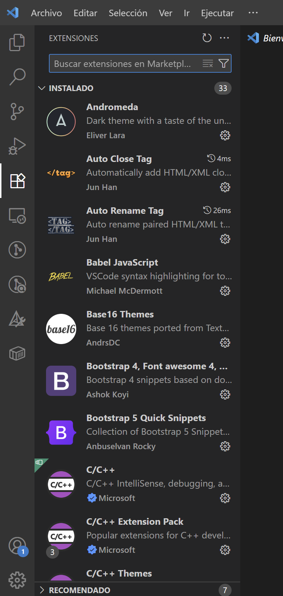
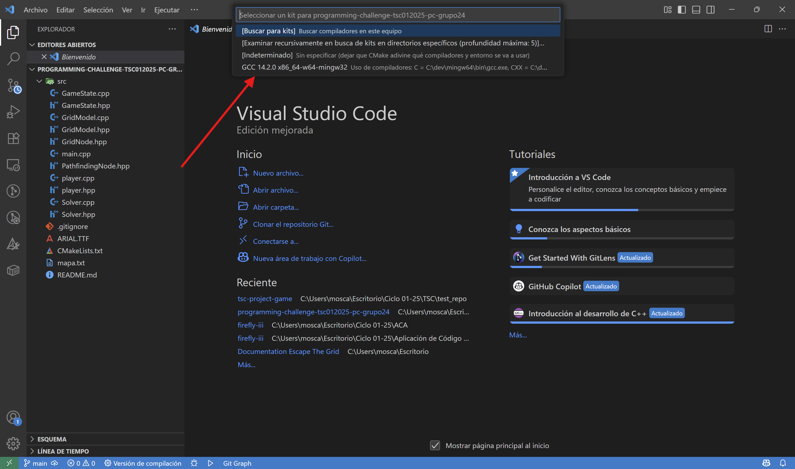
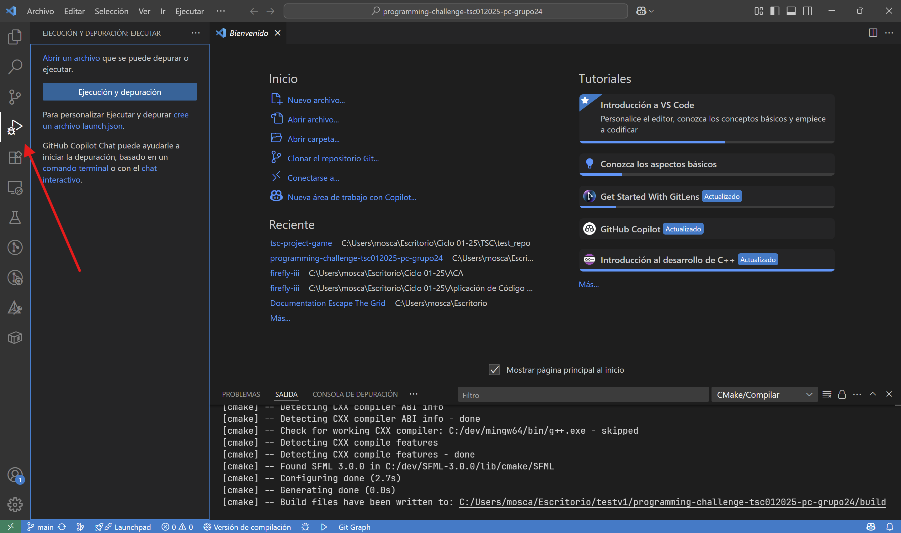
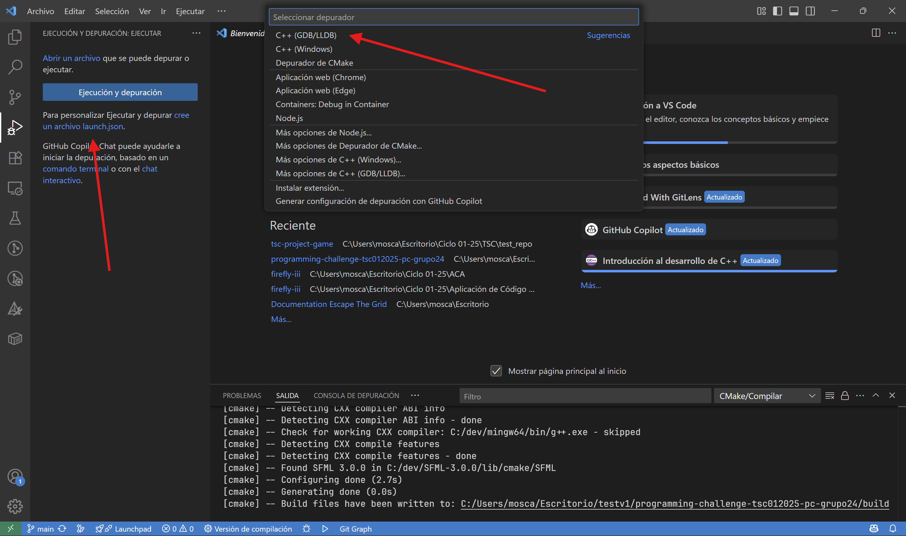
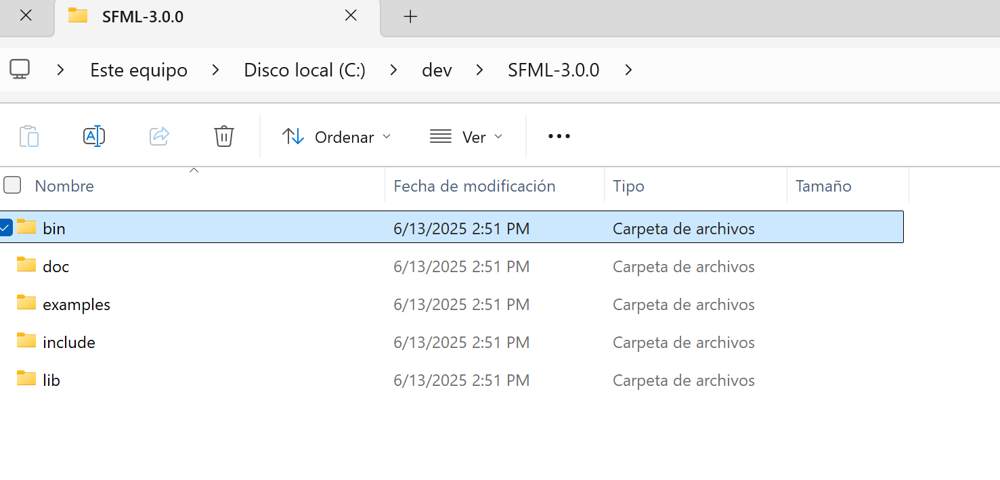
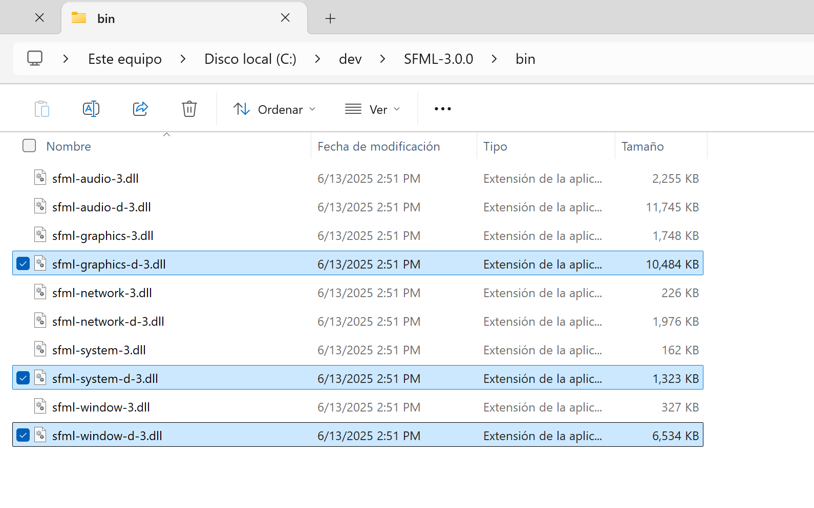
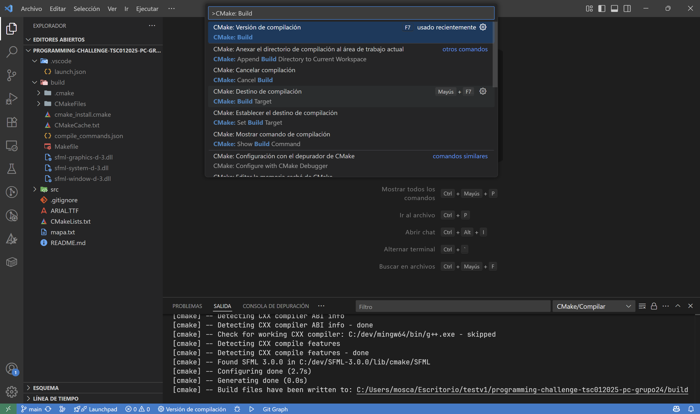
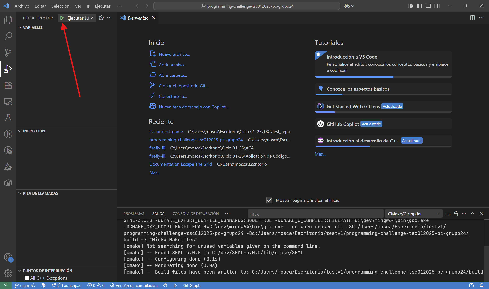
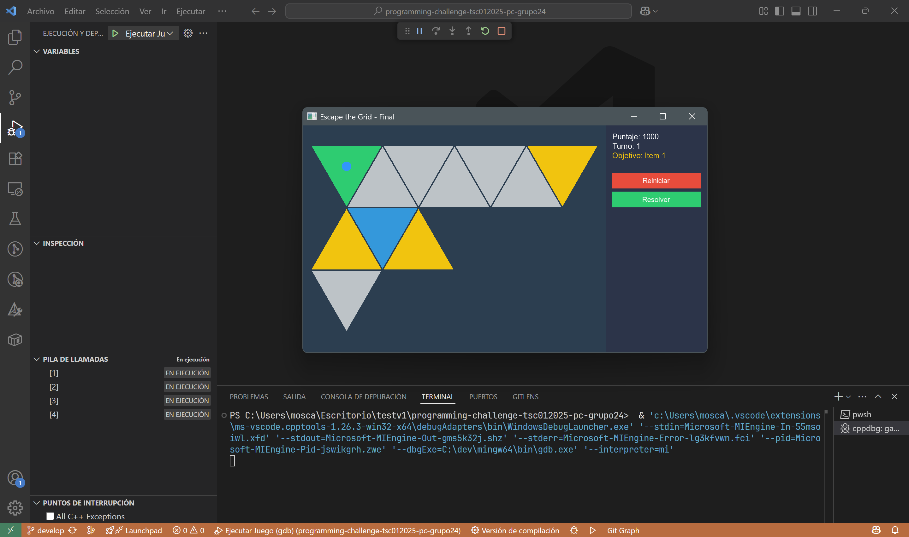

# Instrucciones de Compilación

Este apartado sobre _Instrucciones de Compilación_ describe el proceso completo para preparar el entorno y compilar el proyecto "**Escape the Grid**". Sigue las instrucciones cuidadosamente para asegurarte de que todo funcione correctamente.

## Requisitos Previos

Antes de comenzar, es necesario asegurarse de que todas las herramientas y bibliotecas requeridas estén instaladas y configuradas correctamente. A continuación, se detallan los requisitos previos:

- **Compilador C++17 compatible con SFML 3.0.0**: Visita la sección [Compilador C++](../user_guide/setup_libs/compiler_cpp.md) en _Herramientas y Bibliotecas Requeridas_ para más detalles.
- **SFML 3.0.0 (Simple and Fast Multimedia Library)**: Biblioteca multimedia para desarrollo de software.
- **CMake**: Herramienta de automatización de compilación que facilita la generación de archivos de proyecto para diferentes entornos de desarrollo.
- **Editor de código (VSCode)**: Te recomendamos utilizar Visual Studio Code. Haz [click aquí](https://code.visualstudio.com/download) para descargar.
- **Git**: Configurado previamente con tu cuenta de Github para clonar el repositorio del proyecto. Haz [click aquí](https://git-scm.com/) para descargar.

!!! info "Compatibilidad de Versiones"
    Es necesario que las versiones de las herramientas y bibliotecas coincidan con las especificadas en el proyecto para evitar problemas de compatibilidad. Para más información, consulta cada una de las secciones en **Herramientas y Bibliotecas Requeridas**.

## Configuración y Compilación del Proyecto: Escape the Grid

### Extensiones de Visual Studio Code

Antes de comenzar, asegúrate de tener Visual Studio Code configurado correctamente con las extensiones necesarias para trabajar con C++ y CMake.

1. Abre Visual Studio Code.
2. Navega a la sección de extensiones en la barra lateral izquierda.
    
   

3. Busca e instala las extensiones necesarias:

    - **C/C++ por Microsoft**: Proporciona soporte para el lenguaje C++.

    - **CMake Tools por Microsoft**: Facilita la integración de CMake en Visual Studio Code.

4. Una vez instaladas las extensiones, reinicia Visual Studio Code para que los cambios surtan efecto.

### Clonación del Repositorio

Ahora, necesitamos clonar el repositorio del proyecto desde GitHub. Asegúrate de tener Git instalado y configurado en tu sistema.

1.  Abre una terminal en la ubicación donde deseas clonar el repositorio.
2.  Ejecuta el siguiente comando para clonar el repositorio:

    ```bash
    git clone https://github.com/UCASV/programming-challenge-tsc012025-pc-grupo24.git
    ```

    !!! info "Nota"
        No cierres la terminal después de clonar el repositorio, la ocuparemos para el siguiente paso.

### Configuración del Proyecto en Visual Studio Code

Para este paso, asegúrate de que todas las herramientas y bibliotecas mencionadas en los requisitos previos estén correctamente instaladas y configuradas.

3.  Una vez clonado el repositorio, en la misma terminal, navega al directorio del proyecto utilizando el siguiente comando:

    ```bash
    cd programming-challenge-tsc012025-pc-grupo24
    ```

4.  Ejecuta el siguiente comando para abrir la carpeta del proyecto en Visual Studio Code:

    ```bash
    code .
    ```

5.  Al inciar, se te mostrará una ventana para seleccionar el kit de CMake. Asegúrate de seleccionar el kit que corresponde a tu compilador C++ instalado (`GCC 14.2.0...`).

    

    !!! info "Información"
        Si no ves la ventana para seleccionar el kit de CMake, puedes abrirla manualmente presionando `Ctrl + Shift + P` y buscando "CMake: Select a Kit".

6. Una vez seleccionado el kit, Visual Studio Code comenzará a configurar el proyecto. Espera a que se complete el proceso.

    !!! info "Información"
        Notarás que se creó un folder llamado `build` en la raíz del proyecto. Este es el directorio donde se generarán los archivos de compilación. Por el momento, no te preocupes por este folder, ya que lo utilizaremos más adelante.

7. Ahora, dirigete a la opción "Ejecución y Depuración" en la barra lateral izquierda de Visual Studio Code.

    

8. Selecciona la opción "Cree un archivo `launch.json`" y luego, en la ventana emergente, elige "C++ (GDB/LLDB)".

    

    !!! info "Información"
        Notarás que se creó un archivo `launch.json` en la carpeta `.vscode` en la raíz del proyecto.

9.  Ingresa a este archivo `launch.json` que se creó en el paso anterior y reemplaza el contenido con la siguiente configuración. Luego, guarda los cambios.

    ```json
    {
        "version": "0.2.0",
        "configurations": [
            {
                "name": "Debug",
                "type": "cppdbg",
                "request": "launch",
                "program": "${workspaceFolder}/build/EscapeTheGrid.exe",
                "args": [],
                "stopAtEntry": false,
                "cwd": "${workspaceFolder}",
                "environment": [],
                "externalConsole": false,
                "MIMode": "gdb",
                "setupCommands": [
                    {
                        "description": "Enable pretty-printing for gdb",
                        "text": "-enable-pretty-printing",
                        "ignoreFailures": true
                    }
                ],
                "preLaunchTask": "build"
            }
        ]
    }
    ```

    !!! info "Información"
        Este archivo de configuración le indica a Visual Studio Code cómo ejecutar y depurar el proyecto.

### Compilación del Proyecto

¡Ya está casi listo! Ahora, necesitamos que el proyecto se compile correctamente. Para eso, tenemos que agregar unos archivos de configuración adicionales de SFML 3.0.0 que son necesarios para que el proyecto funcione.

1. Busca la carpeta donde extraíste SFML 3.0.0 en el paso de instalación de SFML. Deberías tener una estructura de carpetas similar a esta:

    ```
    C:\<nombre_de_carpeta>\SFML-3.0.0
    ```

2. Dentro de la carpeta `SFML-3.0.0`, localiza la carpeta `bin` y entra en ella. 

    

3. Una vez dentro de la carpeta `bin`, copia estos archivos `.dll` necesarios como se muestra en la imagen:

    - `sfml-graphics-d-3.dll`
    - `sfml-window-d-3.dll`
    - `sfml-system-d-3.dll`

    

    !!! info "Información"
        Escape The Grid utiliza los módulos `Graphics`, `Window` y `System` de SFML 3.0.0, por lo que solo necesitarás los archivos `.dll` correspondientes a estos módulos.

4. Ahora, ve a la carpeta `build` que se creó en la raíz del proyecto cuando configuraste CMake en Visual Studio Code. Pega los archivos `.dll` que copiaste en el paso anterior dentro de esta carpeta `build`.

    

5. Una vez que hayas pegado los archivos `.dll`, regresa a Visual Studio Code y abre la paleta de comandos presionando `Ctrl + Shift + P`. Busca y selecciona la opción `CMake: Build`. Esto iniciará el proceso de compilación del proyecto.

    

    !!! info "Información"
        Espera a que la compilación se complete. Si todo está configurado correctamente, deberías ver un mensaje de éxito en la terminal de Visual Studio Code.

6. Una vez que la compilación haya finalizado, dirígete nuevamente a la sección de "Ejecución y Depuración" en la barra lateral izquierda de Visual Studio Code. Presiona el botón de "Iniciar Depuración" (o `F5` si te encuentras en Windows) para ejecutar el proyecto.

    

7. Si has hecho todo correctamente, deberías de poder ver la ventana del juego.

    

!!! success "¡Felicidades!"
    Ahora ya sabes cómo compilar y ejecutar con éxito el proyecto **Escape the Grid**. Puedes disfrutar del juego, explorar sus mecánicas desafiantes o modificar el código para agregar nuevas características.