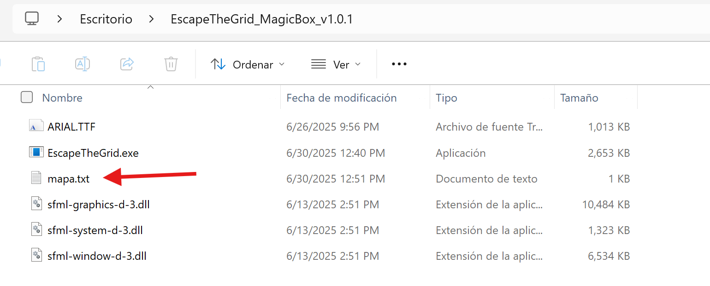

# Mapas Personalizados

Si te sientes creativo y quieres diseñar tus propios laberintos, puedes crear mapas personalizados para Escape the Grid. Aquí te explicamos cómo hacerlo.

## Comprensión de Mapas Personalizados

Antes de comenzar a crear tus propios mapas, es importante entender la estructura de un mapa en Escape the Grid para que tu mapa sea funcional y desafiante.

### Estructura del Archivo

Los mapas personalizados se definen en el archivo de texto `mapa.txt` con una estructura específica. Cada celda del laberinto se representa por un carácter único:

- **`S`**: Punto de inicio del jugador.
- **`.`**: Celda de camino normal, transitable.
- **`W`**: Muro, celda no transitable.
- **`1`, `2`, `3`**: Ítems de la secuencia de la "Caja Mágica".
- **`T`**: Muro temporizado, que se convierte en muro (`W`) después de un número de turnos.
- **`F`**: Celda final u objetivo.

Ejemplo de la estructura de un mapa:

```text
WWWWWWWW
WS.1.T.F
W..W...W
W..2.3.W
WWTT..WW
```
### Reglas de Creación
- El mapa debe de tener la celda de inicio (`S`).
- El mapa debe de tener la celda final (`F`).
- Las celdas de la secuencia de la "Caja Mágica" deben estar numeradas del 1 al 3.
- Se debe de tener en cuenta los turnos (30 movimientos) antes de que los muros temporizados se conviertan en muros permanentes. Es importante hacer el mapa de tal manera que el jugador pueda completar la secuencia de la "Caja Mágica" antes de que los muros temporizados se conviertan en muros permanentes.

!!! info "Información Adicional"
    Si se desean modificar los turnos antes de que se activen los temporizados, únicamente es posible hacerlo modificando el código fuente del juego en el archivo `config.hpp`, ya que actualmente no hay una opción para configurarlo desde el archivo de mapa. Para más detalles sobre cómo compilar el juego, revisa la sección de [Instrucciones de Compilación](./compilation.md).

## Dónde encontrar el Archivo `mapa.txt`

El archivo `mapa.txt` se encuentra en la carpeta del ejecutable del juego, específicamente en la raíz. Para más información sobre como obtener el juego, revisa la sección de [Controles y Jugabilidad](./how_to_play.md).



## Cómo Crear o Modificar un Mapa

Para crear o modificar un mapa personalizado, sigue estos pasos:

1. Abre el archivo `mapa.txt` ubicado en la carpeta del ejecutable del juego en un editor de texto (como Notepad, Visual Studio Code, etc.).
2. Escribe o edita el contenido del archivo siguiendo la estructura mencionada anteriormente.
3. Guarda los cambios en el archivo `mapa.txt`.

!!! info "Información"
    El mismo proceso es utilizado para crear o modificar mapas personalizados en la versión de compilación del juego. El archivo `mapa.txt` se encuentra en la raíz del proyecto. Para más información sobre cómo compilar el juego, revisa la sección de [Instrucciones de Compilación](./compilation.md).

## Cómo Probar tu Mapa

Una vez que hayas creado o modificado el archivo `mapa.txt`, simplemente inicia el juego abriendo el archivo `.exe`. El juego cargará automáticamente el mapa definido en este archivo. Si el mapa es válido, podrás jugarlo inmediatamente.

!!! warning "Precaución"
    - Asegúrate de que el mapa sea válido y siga las [Reglas de Creación](/user_guide/custom_maps/#reglas-de-creacion). Si el mapa no es válido, el juego podría no funcionar correctamente, el mapa podría no cargar o podría haber errores inesperados.

    - El mapa no puede contener otro nombre de archivo que no sea `mapa.txt`. Si deseas probar un mapa diferente, simplemente reemplaza el contenido del archivo `mapa.txt` con tu nuevo diseño.

## Mapas Personalizados Recomendados

Prueba algunos de los siguientes mapas personalizados para comenzar. Del más fácil al más difícil:

### Nivel Fácil
```text
S......1
2T3
F
```

### Nivel Intermedio
```text
WWWWWWWW
WS.1.T.F
W..W...W
W..2.3.W
WWTT..WW
```

### Nivel Difícil
```text
S.....T2
...W.....
W.1......
.........
...WWWWW.
.T...3.W.
..WWW..F.
.........
```

### Nivel Demencial
```text
S...................................................................................................................................................................
....................................................................................................................................................................
....................................................................................................................................................................
........1...........................................................................................................................................................
....................................................................................................................................................................
....................................................................................................................................................................
....................................................................................................................................................................
....................................................................................................................................................................
....................................................................................................................................................................
....................................................................................................................................................................
....................................................................................................................................................................
....................................................................................................................................................................
....................................................................................................................................................................
...........................3........................................................................................................................................
....................................................................................................................................................................
....................................................................................................................................................................
....................................................................................................................................................................
....................................................................................................................................................................
....................................................................................................................................................................
....................................................................................................................................................................
....................................................................................................................................................................
....................................................................................................................................................................
....................................................................................................................................................................
....................................................................................................................................................................
....................................................................................................................................................................
....................................................................................................................................................................
....................................................................................................................................................................
....................................................................................................................................................................
....................................................................................................................................................................
....................................................................................................................................................................
....................................................................................................................................................................
....................................................................................................................................................................
....................................................................................................................................................................
....................................................................................................................................................................
....................................................................................................................................................................
....................................................................................................................................................................
....................................................................................................................................................................
....................................................................................................................................................................
....................................................................................................................................................................
....................................................................................................................................................................
....................................................................................................................................................................
....................................................................................................................................................................
....................................................................................................................................................................
....................................................................................................................................................................
....................................................................................................................................................................
....................................................................................................................................................................
....................................................................................................................................................................
....................................................................................................................................................................
....................................................................................................................................................................
....................................................................................................................................................................
....................................................................................................................................................................
....................................................................................................................................................................
....................................................................................................................................................................
....................................................................................................................................................................
....................................................................................................................................................................
....................................................................................................................................................................
....................................................................................................................................................................
....................................................................................................................................................................
....................................................................................................................................................................
....................................................................................................................................................................
....................................................................................................................................................................
....................................................................................................................................................................
....................................................................................................................................................................
....................................................................................................................................................................
....................................................................................................................................................................
....................................................................................................................................................................
.................................................................2.................................................................................................F
```

!!! tip "Nivel Demencial"
    Este nivel es para poner aprueba las capacidades del algoritmo de resolución automática. En total son aproximadamente 10,000 casillas. El algoritmo de resolución automática puede tardar en dibujar la solución, pero encuentra la solución de manera eficiente. Si deseas ver cómo se resuelve este nivel, puedes activar el modo de resolución automática desde el panel lateral derecho del juego.