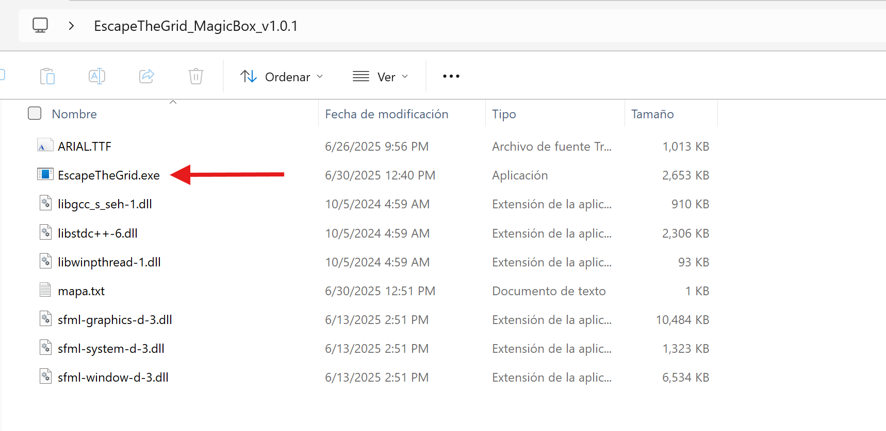
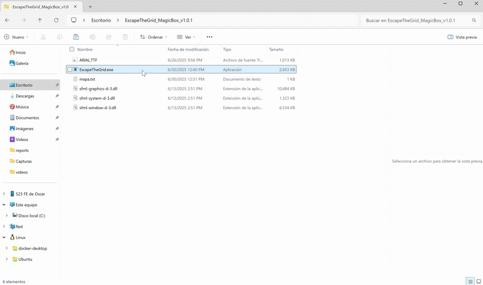
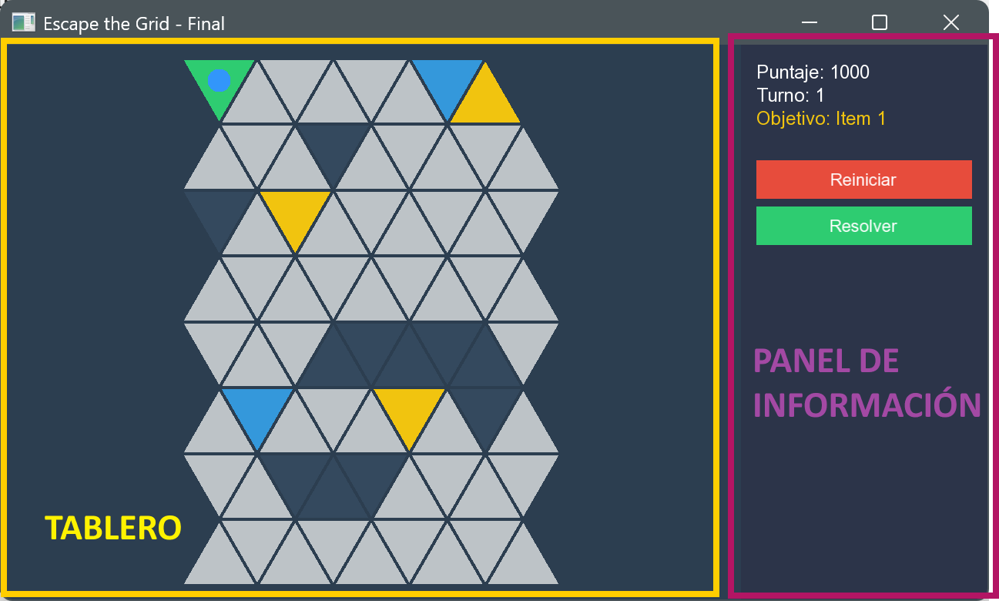

# Controles y Jugabilidad

Bienvenido a la guía de juego de **Escape the Grid: The Magic Box**. En esta sección aprenderás todo lo necesario para comprender la interfaz del juego, dominar los controles básicos y entender las mecánicas que debes dominar para tener éxito en tu aventura. También conocerás el funcionamiento del solver automático que te ayudará a resolver el laberinto de manera eficiente si necesitas asistencia.

## Cómo Obtener el Juego

Pero antes de aprender todo lo necesario y comenzar a jugar, necesitas instalar el juego. Aquí te presentamos dos opciones para hacerlo:

### Opción 1: Descarga el Ejecutable (Recomendado)

La manera más sencilla de empezar es descargar el archivo `.zip` que contiene el ejecutable del juego y otros archivos necesarios.

1. Descarga el archivo que contiene el nombre `EscapeTheGrid_MagicBox_v1.0.1.zip` desde [este enlace](https://ucaedusv-my.sharepoint.com/:f:/g/personal/00109321_uca_edu_sv/Eor_f_IQbMNPlsQvKSqTalYBjj-2u1di-KSuCnpAg07DKg?e=e0l1cu).
2. Extrae el contenido del archivo en la ubicación de tu preferencia.
3. En la carpeta extraída, encontrarás el archivo `EscapeTheGrid.exe` y otros archivos necesarios para ejecutar el juego.

    

    !!! warning "Advertencia"
        Asegúrate de que todos los archivos extraídos permanezcan en la misma carpeta para que el juego funcione correctamente.

        ¿Por qué son importantes los archivos adicionales? Te explicamos:

        - **`EscapeTheGrid.exe`**: Es el ejecutable principal del juego.
        - **`ARIAL.TTF`**: Es la fuente utilizada en el juego para mostrar texto.
        - **`mapa.txt`**: Es un archivo de texto que contiene el mapa del juego. Puedes modificarlo para crear tus propios mapas personalizados. Para crear mapas personalizados puedes consultar la sección [Mapas Personalizados](../custom_maps.md).
        - **Archivos `.dll` para SFML 3.0.0**: Son bibliotecas necesarias para que el juego funcione correctamente. Estos archivos son parte de la biblioteca SFML 3.0.0, que es esencial para la ejecución del juego. Para conocer más detalles sobre como se utiliza SFML en el proyecto, puedes consultar la sección [Biblioteca Gráfica y Manual de Uso](../technical_report/graphics_lib.md).
        - **Archivos `.dll` de C++**: Son bibliotecas necesarias para la ejecución del juego. Estos archivos son parte de la biblioteca estándar de C++ y son esenciales para que el juego funcione correctamente.

4. Ejecuta el archivo `EscapeTheGrid.exe` para iniciar el juego

    

    !!! tip "Recomendación"
        Esta opción es ideal si solo quieres jugar sin preocuparte por el código fuente o la compilación.

    

### Opción 2: Compilación desde el Código Fuente

Si prefieres compilar el juego por tu cuenta (para agregar nuevas características o para asegurarte de que funcione óptimamente en tu sistema). Sigue las instrucciones detalladas en la sección [Instrucciones de Compilación](../compilation.md)

!!! info "Importante"
    Esta opción requiere conocimientos básicos de programación y las herramientas mencionadas en la sección de compilación.

## Preparándote para Jugar

Una vez que tengas el juego instalado y en funcionamiento, es hora de aprender cómo se juega. A continuación, te explicamos la interfaz del juego, los controles básicos y las mecánicas que debes dominar para tener éxito.

### Interfaz de Usuario

La interfaz del juego incluye varios elementos importantes:

- **Panel de Información**: Ubicado en la parte derecha de la pantalla.
    - **Puntaje**: Muestra tus puntos actuales (comienzas con 1000).
    - **Turnos**: Indica el número de turnos que has jugado.
    - **Próximo Objetivo**: Señala cuál es el siguiente elemento de la secuencia que debes activar.

    - **Botones de Control**:
        - **Reiniciar**: Reinicia el juego desde el principio.
        - **[Resolver](/user_guide/how_to_play/#solver-automatico)**: Activa el algoritmo de solución automática, que encontrará y mostrará la ruta óptima.

- **Visualización del Tablero**: El área izquierda muestra el laberinto de triángulos donde interactuarás con el juego.

     

    

#### Tipos de Celdas
- **Celda Verde**: Representa el inicio del puzzle.
- **Celdas Blancas**: Representan las celdas vacías donde puedes moverte.
- **Celdas Gris Oscuro**: Son las paredes del laberinto, que no puedes atravesar.
- **Celdas Amarillas**: Son las celdas que debes activar en el orden correcto para completar la secuencia de la Caja Mágica.
- **Celdas Azules**: Se convertirán en muros después de 30 turnos, bloqueando el acceso a ellas.
- **Celdas Grises**: Representan el camino que ya has recorrido. No podrás volver a estas celdas sin perder puntos.
- **Celda Rosada**: Representan la salida del laberinto, que se hará visible una vez que completes la secuencia de la Caja Mágica.

    

### Controles Básicos

El juego está diseñado para ser intuitivo y fácil de controlar, utilizando únicamente el mouse para todas las interacciones.

#### Control con el Mouse

- **Clic Izquierdo**: Es tu herramienta principal para interactuar con el juego.
    - **En Celdas Triangulares**: Al hacer clic en una celda adyacente válida, tu personaje se moverá hacia ella.
    - **En Botones de la Interfaz**: Activa las diferentes funciones del juego.

     

    

!!! tip "Movimientos Válidos"
    Solo podrás moverte a celdas adyacentes que no sean paredes y que estén conectadas directamente a tu posición actual. Las celdas válidas se resaltarán cuando coloques el cursor sobre ellas. El camino por el que ya te has movido se muestra en gris, y no podrás volver a él sin perder puntos.

### Mecánicas del Juego

Antes de comenzar tu aventura, es crucial que comprendas las mecánicas del juego. Aquí te explicamos los elementos clave que debes dominar:

#### Caja Mágica
Tu objetivo principal es activar la Caja Mágica pasando por las celdas amarillas en el orden correcto. Solo al completar esta secuencia podrás hacer visible la salida del laberinto.

#### Salida Oculta
La salida del laberinto permanecerá oculta hasta que completes la secuencia correcta de la Caja Mágica (la salida se muestra en color rosado fucsia).

#### Paredes Temporizadas 
Las celdas azules se convertirán en paredes después de sobrepasar la cantidad de 30 turnos, bloqueando el acceso a ellas. Debes planificar tus movimientos para evitar quedarte atrapado.

#### Puntuación (Backtracking)
Comienzas con 1000 puntos. Cada vez que retrocedas por un camino ya recorrido (el camino ya recorrido se muestra en gris), perderás 50 puntos. Si te quedas sin puntos o sin movimientos posibles, perderás el juego.

## Solver Automático

El solver automático es una herramienta avanzada que te permite ver la solución óptima al laberinto. Al hacer clic en el botón "Resolver", el juego utilizará el algoritmo A* (puedes encontrar más información sobre este algoritmo en la sección de [Algoritmos Implementados](../technical_report/algorithms.md)) para encontrar y mostrar la ruta más eficiente hacia la salida.

El solver actua de dos maneras:

- **Visualización de la Ruta**: Muestra la ruta óptima en el tablero, resaltando las celdas que debes seguir.
- **Reproducción Automática**: Después de mostrar la ruta óptima, automáticamente reproduce los movimientos necesarios para completar el laberinto, permitiéndote observar cómo se resuelve el puzzle paso a paso.

El Solver Automático tiene conocimiento de la estructura del laberinto y sobre las reglas del juego, lo que le permite encontrar soluciones eficientes.

Esta herramienta se puede ejecutar en diferentes casos:

- **Al iniciar el juego**: Para ver la solución desde el principio.
- **Después de realizar algunos movimientos**: Para obtener una solución parcial basada en tu progreso actual. El Solver es consciente de los movimientos que has realizado y ajustará la solución en consecuencia.
- **Cuando no existe una ruta optima desde la posición actual**: El solver al ser consiente de la situación actual del juego te indicará que no hay una ruta posible desde tu posición actual posiblemente porque te quedarás sin puntos en tus proximos movimientos (si es necesario hacer backtracking) o porque no hay una ruta posible desde tu posición actual (por si la ruta está bloqueada por los muros temporizados).

## Información Adicional

- Para ver en acción todas las mecánicas del juego, revisa la sección de [Guía Visual](visual_guide.md).

- Si deseas crear tus propios mapas personalizados, consulta la sección de [Mapas Personalizados](custom_maps.md) para aprender cómo diseñar laberintos únicos y desafiantes.