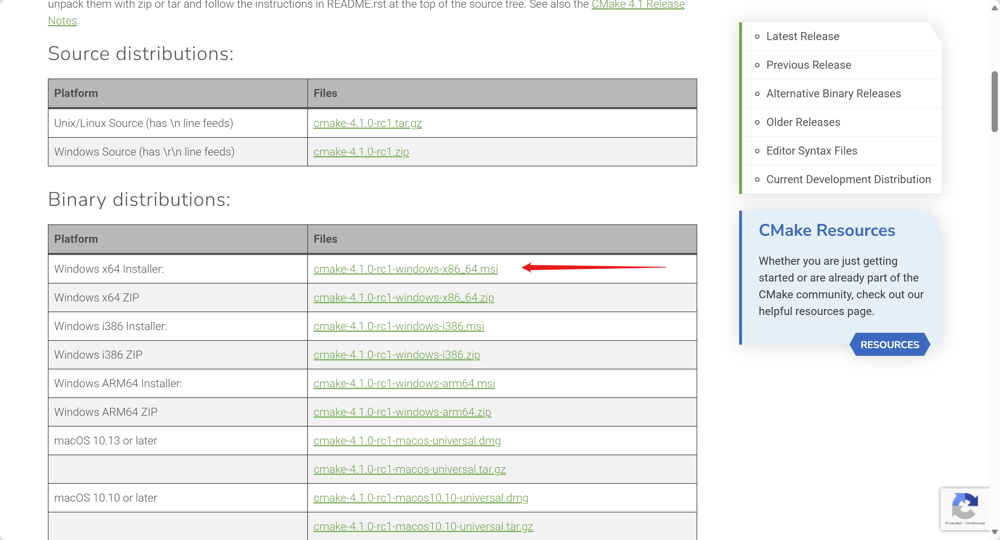
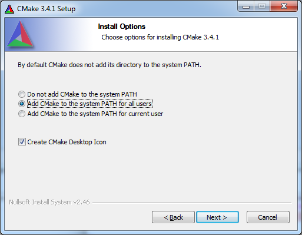

# CMake

## Guía para Descarga e Instalación de CMake

En esta sección, se detallan los pasos para descargar e instalar CMake, una herramienta esencial para la compilación del proyecto "Escape the Grid". CMake es un sistema de automatización de compilación que utiliza archivos de configuración para generar archivos de proyecto específicos del entorno de desarrollo.

## Instalación en Windows

### Descargar el instalador de CMake

1. Visita la página oficial de [CMake](https://cmake.org/download/) y descarga el instalador para Windows. Asegúrate de seleccionar la versión adecuada para tu sistema operativo (32-bit o 64-bit).

    

2. Una vez descargado, ejecuta el instalador.

3. Presiona "Next" en la pantalla de bienvenida del instalador.

4. Presiona "I Agree" para aceptar los términos de la licencia.

### Agregar CMake al PATH

1. Durante la instalación, asegúrate de seleccionar la opción "Add CMake to the system PATH for all users" para que CMake esté disponible desde cualquier terminal.

    

    *Esta imagen es ilustrativa solo para mostrar la opción de agregar CMake al PATH. El aspecto visual puede variar según la versión del instalador.*

    !!! warning "Importante"
        Si no seleccionas esta opción, tendrás que agregar manualmente la ruta de CMake a las variables de entorno del sistema.

2. Completa la instalación haciendo clic en "Install" y luego en "Finish" cuando se complete el proceso.


### Verificar la instalación

1. Abre una terminal y escribe el siguiente comando para verificar que CMake se ha instalado correctamente:

    ```bash
    cmake --version
    ```

    !!! info "Información"
        Si ves la versión de CMake, significa que la instalación fue exitosa y CMake está correctamente configurado en tu sistema.

## Otros Sistemas Operativos

Para otros sistemas operativos, como macOS o Linux, puedes instalar CMake utilizando el gestor de paquetes correspondiente:

- En macOS, puedes usar Homebrew:
```bash
brew install cmake
```

- En Ubuntu o Debian, puedes usar APT:
```bash
sudo apt-get install cmake
```
!!! success "¡Instalación exitosa!"
    Ahora tienes CMake instalado y configurado en tu sistema, listo para ser utilizado.