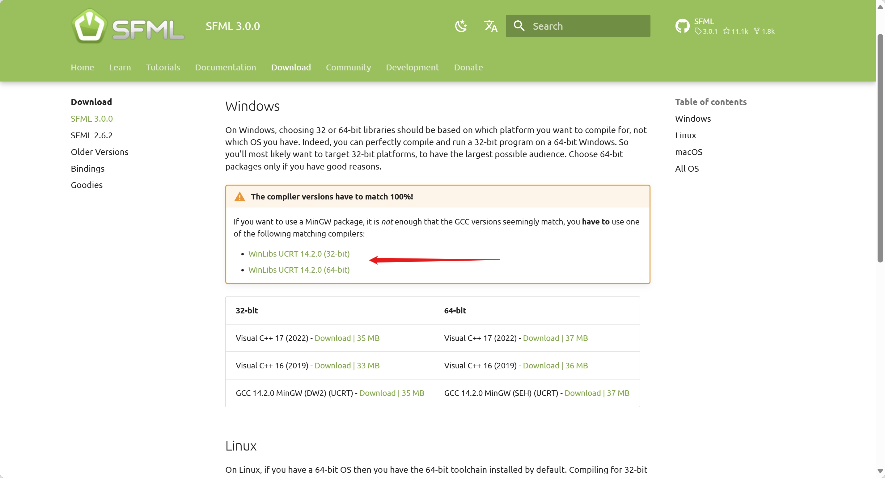
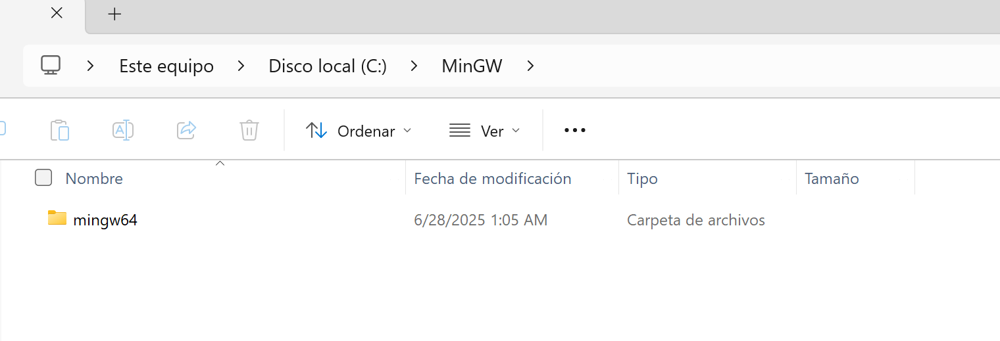
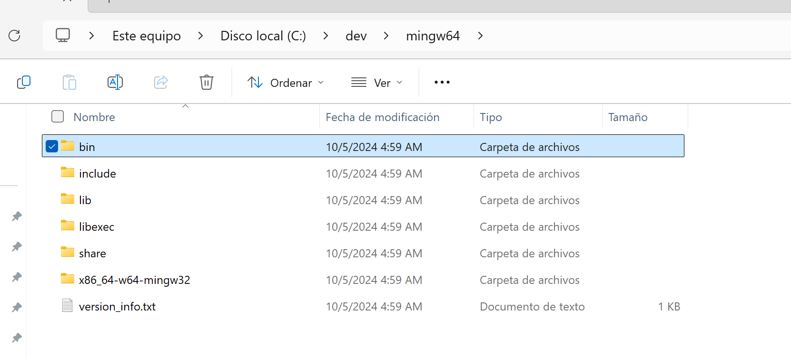
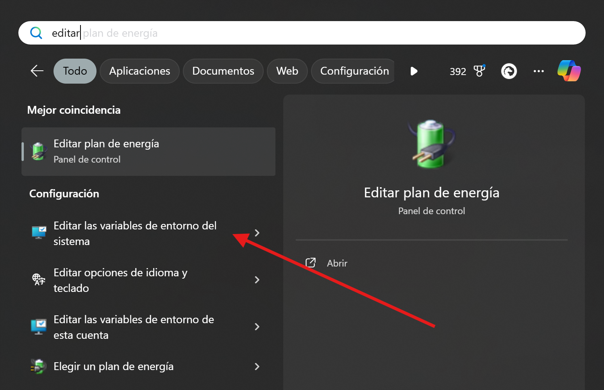
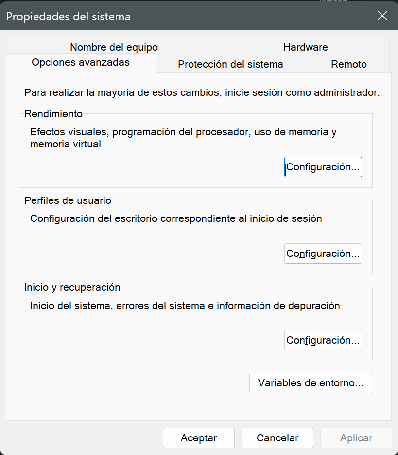
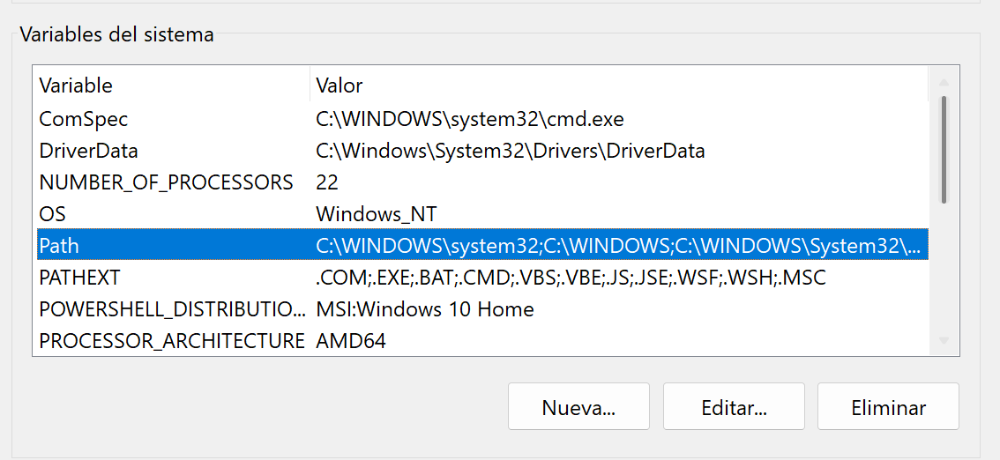
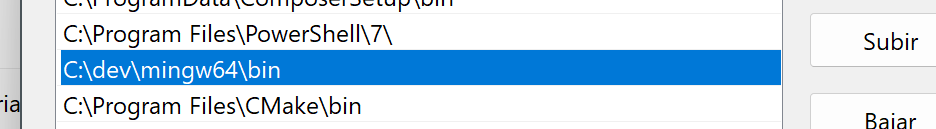

# Compilador de C++17


## Guía para Configuración e Instalación del Compilador C++

En este apartado se detallan los pasos necesarios para configurar un compilador C++ adecuado para el desarrollo del juego "Escape the Grid". Es esencial contar con un compilador compatible con las bibliotecas y herramientas utilizadas en el proyecto, especialmente SFML 3.0.0.

## Instalación en Windows

### Descargar desde la documentación de SFML 3.0.0

1. Visita la página oficial de [SFML 3.0.0](https://www.sfml-dev.org/download/sfml/3.0.0/#windows) y descarga la versión `WinLibs UCRT 14.2.0` (asegurate de que sea la versión correcta para tu sistema operativo, ya sea 32-bit o 64-bit).



*La descarga te proporcionará un archivo comprimido `.zip` que contiene los archivos necesarios para el compilador C++.*


!!! info "¿Por qué es necesario instalar estos compiladores específicos de C++ para SFML?"
    SFML está distribuido en versiones precompiladas que fueron construidas usando compiladores muy específicos (por ejemplo, WinLibs UCRT 14.2.0).  
    
    Si intentas compilar tu proyecto con una versión diferente de MinGW o GCC, aunque el número de versión parezca coincidir, pueden existir diferencias internas que provoquen errores de enlace, incompatibilidades o fallos en tiempo de ejecución.  
    
    Por eso, **debes instalar exactamente el mismo compilador** que se indica en la página de descargas de SFML para garantizar que tu proyecto funcione correctamente y evitar problemas difíciles de diagnosticar.

### Descomprimir el archivo descargado

1. Crea una carpeta en el disco local `C:\<nombre_de_carpeta>` (esta ubicación es recomendada, pero puedes elegir otra ruta si lo prefieres).

2. Copia el archivo `.zip` descargado en la carpeta creada.

3. Extrae el contenido del archivo `.zip` descargado. El resultado de la extracción debería ser como se muestra a continuación:

    

### Configuración de Variables de Entorno

1. Dentro de la carpeta `mingw64` (que extrajiste en el paso anterior), localiza la carpeta `bin` que contiene los archivos ejecutables del compilador e ingresa a ella.

    

2. Copia la ruta absoluta desde la carpeta `bin`.

    !!! info
        La ruta debería ser algo como `C:\<nombre_de_carpeta>\mingw64\bin` si seguiste la ubicación de ruta recomendada.

3. Presiona la tecla `Windows` y en la barra de búsqueda escribe "Variables de entorno", luego selecciona la opción tal como se muestra en la imagen:

    

4. En la ventana de "Propiedades del sistema", haz clic en el botón "Variables de entorno".

    

5. En la ventana "Variables de entorno" y en la sección "Variables del sistema", busca la variable llamada `Path` y selecciónala. Luego haz clic en "Editar".

    

6. En la ventana "Editar variable de entorno", haz clic en "Nuevo" y pega la ruta absoluta que copiaste en el paso 2. 

    

7. Luego haz clic en "Aceptar" para cerrar todas las ventanas.

8. Para verificar que la configuración se realizó correctamente, abre una nueva ventana de terminal y ejecuta el comando el siguiente comando:

    ```bash
    g++ --version
    ```

    Si la instalación y configuración fueron exitosas, deberías ver la versión del compilador C++ instalada.

## Instalación en MacOS

### Xcode para Compilación de C++

Para compilar C++ en macOS, es necesario instalar las herramientas de desarrollo de Xcode, que incluyen el compilador `clang` y otras utilidades necesarias. A continuación se detallan los pasos para instalar el compilador C++ en macOS:

1. Instalar las herramientas de desarrollo de Xcode


    ```bash
    xcode-select --install
    ```

    Esto instalará los compiladores y utilidades básicas necesarias para el desarrollo en C/C++ en macOS.

!!! success "¡Instalación exitosa!"
    Ahora tienes un compilador C++ compatible con SFML 3.0.0 instalado y configurado en tu sistema, listo para ser utilizado.