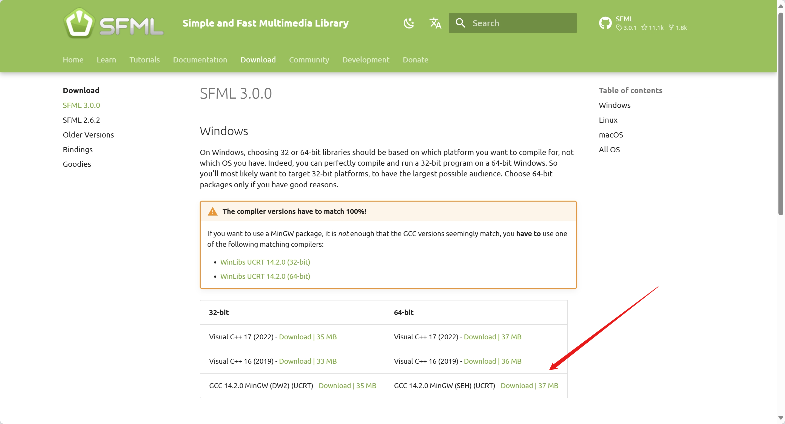
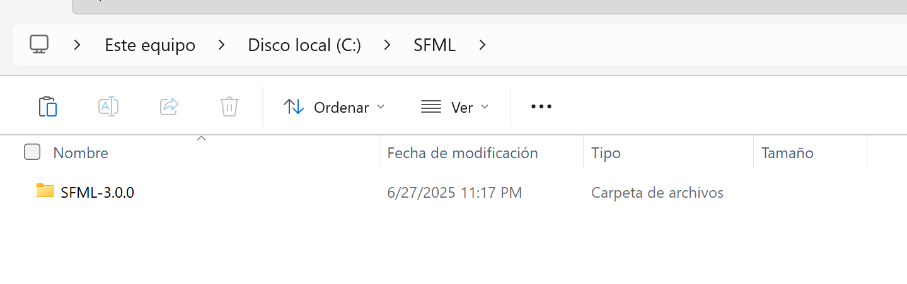
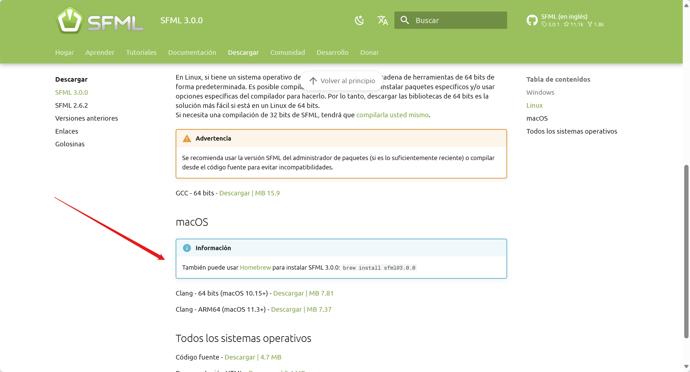

## Guía para Descarga de SFML 3.0.0

En esta sección, se detallan los pasos para descargar SFML 3.0.0, que es esencial para el desarrollo del juego "Escape the Grid". SFML es una biblioteca multimedia que proporciona herramientas para manejar gráficos, sonido y entrada de usuario de manera eficiente.

Los modulos de SFML utilizados en este proyecto son:

- **Graphics**: Para renderizar gráficos en 2D.
- **Window**: Para manejar ventanas y eventos de entrada.
- **System**: Para manejar el sistema y las operaciones básicas.

## Instalación en Windows

### Descargar SFML 3.0.0

1. Visita la página oficial de [SFML 3.0.0](https://www.sfml-dev.org/download/sfml/3.0.0/#windows) y descarga la versión `GCC 14.2.0 MinGW (SEH) (UCRT)` (asegúrate de que sea la versión correcta para tu sistema operativo, ya sea 32-bit o 64-bit) para Windows como se muestra en la imagen:



*La descarga te proporcionará un archivo comprimido `.zip` que contiene los archivos necesarios para utilizar SFML en tu proyecto.*

### Extraer los archivos

1. Crea una carpeta en el disco local `C:\<nombre_de_carpeta>` (esta ubicación es recomendada, pero puedes elegir otra ruta si lo prefieres).

2. Copia el archivo `.zip` descargado en la carpeta creada.

3. Extrae el contenido del archivo `.zip` descargado. El resultado de la extracción debería ser como se muestra a continuación:

    

    !!! info "Información"
        Por el momento, no es necesario mover la carpeta `SFML-3.0.0` a otra ubicación, ya que el proyecto se configurará para utilizarla directamente desde su ubicación actual. En la sección "**Instrucciones de Compilación**", se explicará cómo configurar el proyecto para que utilice esta carpeta y sus archivos necesarios.

## Instalación en MacOS

### Descargar Utilizando Homebrew

- Abre una terminal y utiliza Homebrew para instalar SFML ejecutando el siguiente comando:

```bash
brew install sfml@3.0.0
```

### Descarga Manual

- También, puedes descargar SFML 3.0.0 desde la [documentación oficial de SFML 3.0.0](https://www.sfml-dev.org/download/sfml/3.0.0/) y seguir las instrucciones de instalación manual.




## Otros Sistemas Operativos

- Para otros sistemas operativos, consulta la [documentación oficial de SFML 3.0.0](https://www.sfml-dev.org/download/sfml/3.0.0/) para obtener instrucciones específicas de instalación.

!!! success "¡Instalación exitosa!"
    Ahora tienes SFML 3.0.0 listo para usarse.