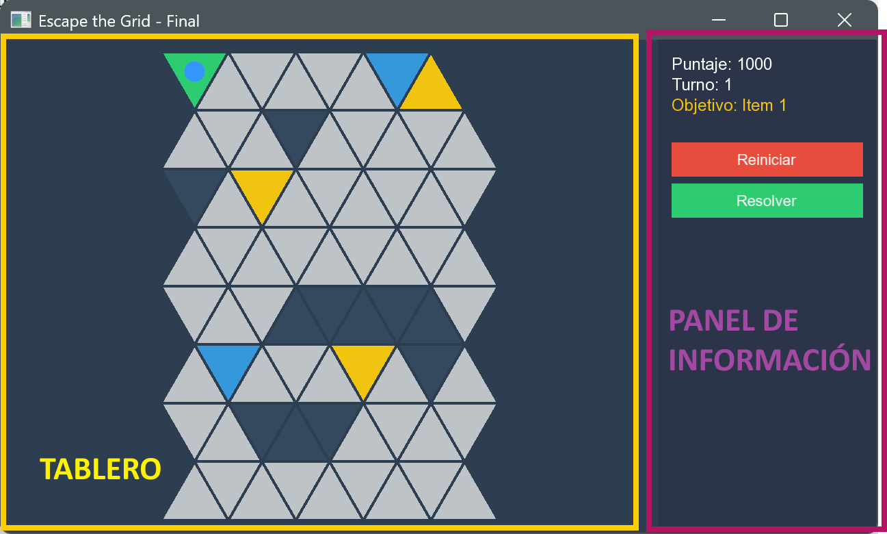
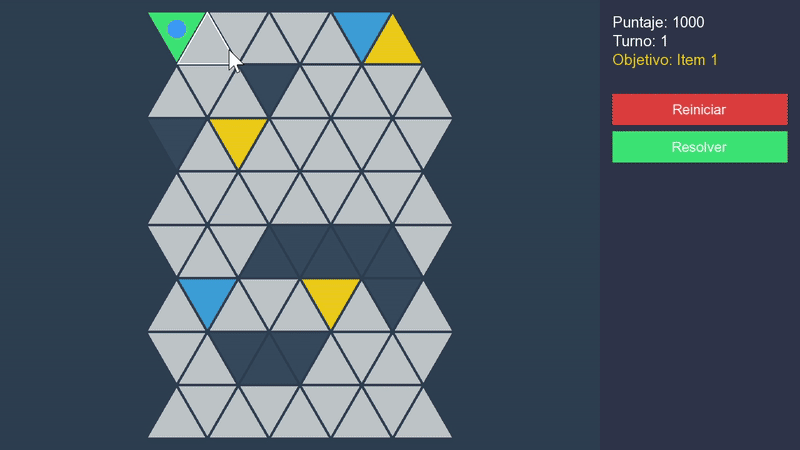
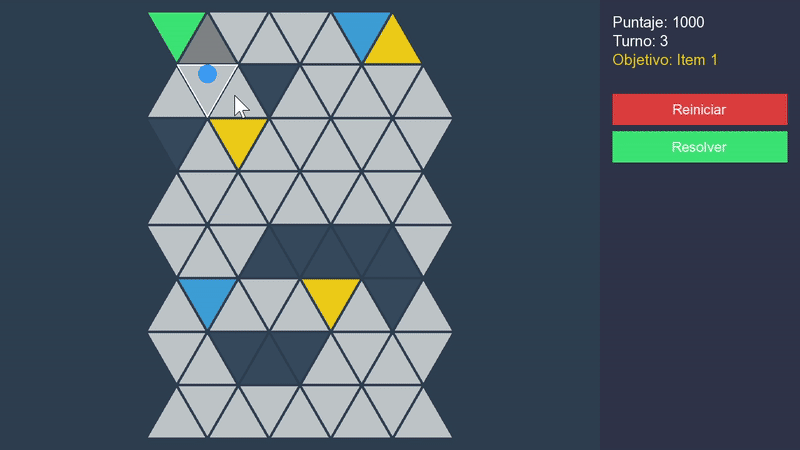
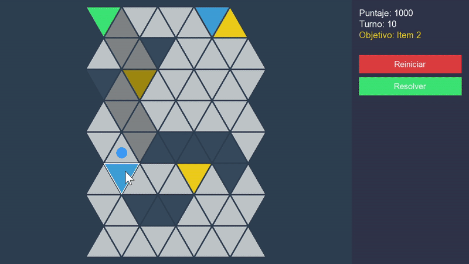

# Guía Visual

En esta sección, te proporcionaremos una guía visual que te ayudará a comprender mejor las mecánicas del juego y cómo interactuar con él. A continuación, encontrarás una serie de imágenes o GIFs mostrando las diferentes partes del juego, desde la interfaz hasta las mecánicas de la Caja Mágica y el solver automático.

## Interfaz del Juego

## Mecánicas del Juego

### Caja Mágica

La Caja Mágica es el elemento central del juego. Debes activar las celdas amarillas en el orden correcto para hacer visible la salida del laberinto.

### Paredes Temporizadas

Las celdas azules se convertirán en muros impenetrables después de 30 turnos. Debes planificar tus movimientos para evitar quedarte atrapado.

### Movimiento y Backtracking

El movimiento se realiza haciendo clic en las celdas adyacentes. Si retrocedes por un camino ya recorrido, perderás puntos.

## Solver Automático

El solver automático te ayudará a encontrar la ruta óptima hacia la salida. Puedes activarlo desde el panel lateral derecho del juego.

- Desde el inicio del juego:

- Después de realizar algunos movimientos:

- Al no encontrar una ruta óptima:

